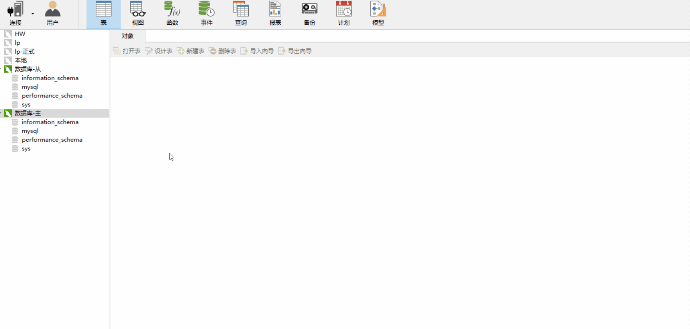

### docker安装mysql

```bash
# 主服务器
docker run --name master-mysql -p 3306:3306 -e MYSQL_ROOT_PASSWORD=123456 -d mysql:5.7.30

# 从服务器
docker run --name sub-mysql -p 3307:3306 -e MYSQL_ROOT_PASSWORD=123456 -d mysql:5.7.30
```

### 配置主数据库
```bash
vi /etc/mysql/my.cnf
```

如果不能使用`vi`，请参考文章末尾的**【问题答疑】**

编辑主数据库配置文件，在配置文件尾部添加以下代码：
```bash
[mysqld]
#设置主服务器的ID
server-id=100
innodb_flush_log_at_trx_commit=2
# 开启binlog日志同步功能
sync_binlog=1
# binlog日志文件名
log-bin=mysql-bin-5
# 这个表示只同步某个库 （如果没有此项，表示同步所有的库）
# binlog-do-db=xxxx
```

重启`docker restart master-mysql`，并进入主数据库容器，连接`mysql`
```bash
> mysql -u root -p
Enter password:
```

**给从数据库设置登录账户及密码**
```bash
CREATE USER 'slave'@'%' IDENTIFIED BY '123456';
GRANT REPLICATION SLAVE, REPLICATION CLIENT ON *.* TO 'slave'@'%';
```

**查看主数据库的状态**`show master status \G`
```bash
mysql> show master status \G
*************************** 1. row ***************************
             File: mysql-bin-5.000001
         Position: 617
     Binlog_Do_DB:
 Binlog_Ignore_DB:
Executed_Gtid_Set:
1 row in set (0.00 sec)
```
记录这里展示的`File`和`Position`字段，从服务器需要使用，我这里的两个字段的值分别是`mysql-bin-5.000001`、`617`，顺序不可颠倒，因为数据库的写操作会引起`Position`的值变化。

### 配置从数据库
```bash
vi /etc/mysql/my.cnf
```

如果不能使用`vi`，请参考文章末尾的[问题答疑]

编辑主数据库配置文件，在配置文件尾部添加以下代码：
```bash
[mysqld]
server-id=200
innodb_flush_log_at_trx_commit=2
sync_binlog=1
log-bin=mysql-bin-6
```

重启`docker restart sub-mysql`，并进入主数据库容器，连接`mysql`
```bash
> mysql -u root -p
Enter password:
```

**设置主从复制的连接信息**
```bash
mysql> change master to master_host='10.192.32.156', master_user='slave', master_password='123456', master_port=3306, master_log_file='mysql-bin-5.000001', master_log_pos= 617, master_connect_retry=30;
```
***参数说明***：<br>
master_host：宿主机(即真实机器)的`ip`<br>
master_user：主数据库给从数据库分配的登录账号<br>
master_password：主数据库给从数据库分配的登录密码<br>
master_port：主数据库的端口<br>
master_log_file：主数据库的日志文件，主数据库的写操作导致日志文件容量到达阈值时会变化<br>
master_log_pos：主数据库日志文件中的位置，主数据库的写操作或容器的重启会导致该值变化<br>
master_connect_retry：连接失败时的重连间隔，默认为60秒

查看主从状态`show slave status \G`，可以看到`Slave_IO_Running`和`Slave_SQL_Running`都是`NO`，因为我们只是对其进行了配置，但是没有开启
```bash
mysql> show slave status \G;
*************************** 1. row ***************************
               Slave_IO_State: Connecting to master
                  Master_Host: 10.192.32.156
                  Master_User: slave
                  Master_Port: 3306
                Connect_Retry: 30
              Master_Log_File: mysql-bin-5.000001
          Read_Master_Log_Pos: 617
               Relay_Log_File: d0678ce118a6-relay-bin.000001
                Relay_Log_Pos: 4
        Relay_Master_Log_File: mysql-bin-5.000001
             Slave_IO_Running: No
            Slave_SQL_Running: No
```

### 开启主从同步功能
在从数据库中进入`mysql`并开启主从同步功能`start slave \G`，并重新查看主从同步状态
```bash
mysql> show slave status \G
*************************** 1. row ***************************
               Slave_IO_State: Connecting to master
                  Master_Host: 10.192.32.156
                  Master_User: slave
                  Master_Port: 3306
                Connect_Retry: 30
              Master_Log_File: mysql-bin-5.000001
          Read_Master_Log_Pos: 617
               Relay_Log_File: d0678ce118a6-relay-bin.000001
                Relay_Log_Pos: 4
        Relay_Master_Log_File: mysql-bin-5.000001
             Slave_IO_Running: Yes
            Slave_SQL_Running: Yes
```

至此所有的主从复制功能已经配置完成，来看看效果吧



### 问题答疑：
1、`vi /etc/mysql/my.cnf`操作失败
需要先执行，从数据库也是同样
```bash
apt-get update
apt-get install vim
```

2、`Slave_SQL_Running`字段为`No`
检查主数据库的`Position`变化了，因为数据库的写操作或容器的重启会造成`Position`变化

3、`Slave_IO_Running`一直为连接状态
检查`change master to ...;`是否配置正确，其中`master_host`是宿主机(即真实机器的地址，不能用`127.0.0.1`或者`localhost`)
